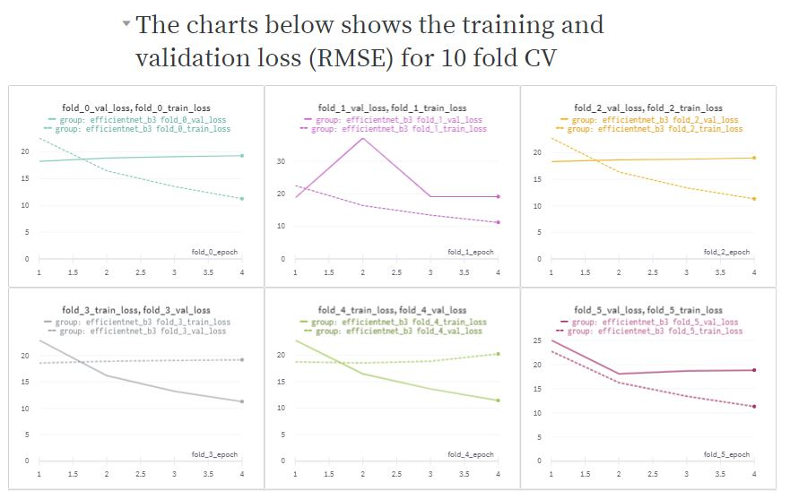

## Pawpularity Contest
This repository contains the EDA, training and submission code for kaggle Pawpularity contest competition
### kaggle link
https://www.kaggle.com/c/petfinder-pawpularity-score

### technologies used in these notebooks
1. swinTransformer
2. EfficientNet
3. Training if mixed precision
4. integration and weights and biases
5. GradCam for interpretability of computer vision classification task
6. Crossvalidation and ensembling

## Weights and Biases report link
https://wandb.ai/zuozhe/Pawpularity/reports/Pawpularity-training-charts--VmlldzoxMjYwNjc2?accessToken=ut2ikla3qvdbwgzx1k5j1qhbnp3za6817pl74k7ifl2kf8c33jor6824za13i8ol

## GradCAM efficientNet

## GradCAM swinTransformer
We could see that we are not getting good results with swinTransformers

